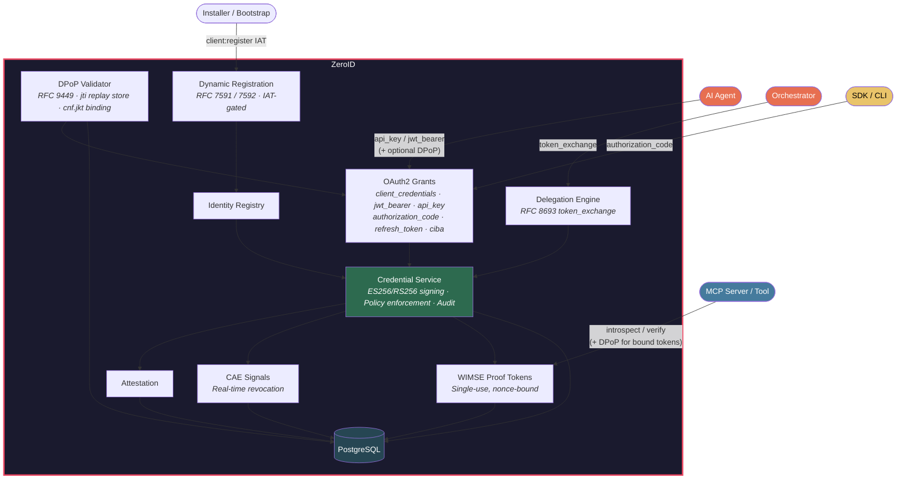

<p align="center">
  <h1 align="center">ZeroID</h1>
  <p align="center"><strong>Identity Infrastructure for Autonomous Agents</strong></p>
  <p align="center">
    Issue short-lived agent credentials · Delegate between agents · Attest · Revoke in real-time
    <br/>
    OAuth 2.1 &middot; WIMSE/SPIFFE &middot; RFC 8693 delegation &middot; Developer SDKs
  </p>
  <p align="center">
    <a href="https://github.com/highflame-ai/zeroid/actions/workflows/release.yml">
      
    </a>
    <a href="https://goreportcard.com/report/github.com/highflame-ai/zeroid">
      
    </a>
    <a href="https://github.com/highflame-ai/zeroid/releases">
      
    </a>
    <a href="https://pkg.go.dev/github.com/highflame-ai/zeroid">
      
    </a>
    <a href="https://github.com/highflame-ai/zeroid/blob/main/LICENSE">
      
    </a>
    <a href="https://discord.gg/zeroid">
      
    </a>
  </p>
</p>

---

## The Problem

When an AI agent takes an action, commits code, calls an API, or modifies a record, the question every security and compliance team asks is:

> *"Which agent did this, acting on whose authority, with what permissions?"*

Today's agents often answer this question badly—or not at all. They impersonate users via shared service accounts, creating no auditable distinction between the human who authorized the action and the agent that executed it. OAuth/OIDC tokens weren't designed for agents that spawn sub-agents, operate without humans in the loop, or need their delegation chains verified across a multi-step workflow.

The [OpenID Foundation's October 2025 whitepaper on Identity Management for Agentic AI](https://openid.net/wp-content/uploads/2025/10/Identity-Management-for-Agentic-AI.pdf) identifies this as the industry's most urgent unsolved problem: *"User impersonation by agents should be replaced by delegated authority. True delegation requires explicit 'on-behalf-of' flows where agents prove their delegated scope while remaining identifiable as distinct from the user they represent."*

**ZeroID** is the open source implementation of Agent Identity.

## What Is ZeroID

ZeroID is identity infrastructure for autonomous agents: a system that issues cryptographically verifiable credentials, enforces delegated authority through chains of agents, and revokes access in real time. Built on OAuth 2.1, WIMSE/SPIFFE, and RFC 8693, it implements the industry's emerging standards for agent identity before they become requirements.

Each agent gets a stable, globally unique identity URI. When one agent delegates to another, scope is automatically attenuated—the sub-agent can only receive permissions the orchestrator already holds, capped by the sub-agent's own policy. Every token carries the full on-behalf-of chain: who authorized it, what scope was granted, and how deep the delegation goes. Every action is attributable, cryptographically.

At Highflame, we have been using ZeroID to power our Agent Control & Governance Platform for several months now and we are contributing this to open source to further the state of the industry to solve this important problem. 

**The model:**

```
Root authority (human, policy, or orchestrator agent) authorizes Agent A
        ↓
Agent A gets a scoped credential with its WIMSE identity URI
        ↓
Agent A delegates a subset of its scope to Agent B (RFC 8693 token exchange)
        ↓
Agent B's token carries: its own identity + delegation chain + original authorizer
        ↓
Any system Agent B calls can verify the full chain cryptographically
```

The root can be a human, org policy, or another agent. Fully autonomous workflows work without anyone in the loop.

## Why Not OAuth/OIDC or Service Accounts?

OAuth 2.1 works well for Human identity, it works partially for a single agent accessing tools within one trust domain. But, the model completely breaks down the moment agents operate asynchronously, spawn sub-agents, or cross organizational boundaries. Service accounts are worse: they're shared, opaque, and leave no delegation trail at all.

|  | Service Accounts | OAuth/OIDC | ZeroID |
|---|---|---|---|
| Per-agent identity | ❌ Shared | ✅ | ✅ |
| Agent-specific metadata (type, framework, version) | ❌ | ❌ | ✅ |
| On-behalf-of (OBO) delegation chain | ❌ | ❌ | ✅ RFC 8693 |
| Scope attenuation at each delegation step | ❌ | ❌ | ✅ |
| Delegation depth enforcement | ❌ | ❌ | ✅ |
| Real-time revocation with cascade | ❌ | ❌ | ✅ CAE / SSF signals |
| Autonomous workflows (no human in the loop) | ❌ | ❌ | ✅ |
| Open source, standards-based | ❌ | Partial | ✅ |

## The Core Distinction: 
OAuth/OIDC authenticates a human to a service. **ZeroID implements true delegated authority.** Agents are distinct from the users who authorize them, and every token proves it.

## Features

- **Agent Identity Registry** — Register agents, MCP servers, services, and applications as first-class entities. Classify by role (`orchestrator`, `autonomous`, `tool_agent`), enrich with metadata (`framework`, `version`, `publisher`, `capabilities`), assign trust levels, and manage the full lifecycle: register → activate → deactivate → de-provision.
- **OAuth 2.1 Token Issuance** — Full OAuth 2.1 support: `client_credentials`, `jwt_bearer` (RFC 7523), `token_exchange` (RFC 8693) for delegation, `api_key`, `authorization_code` (PKCE), `refresh_token`, `urn:openid:params:grant-type:ciba` (OpenID CIBA Core 1.0).
- **DPoP Sender-Constrained Tokens** — RFC 9449. Clients may attach a `DPoP` proof JWT to any `/oauth2/token` call; the issued token then carries `cnf.jkt` and `token_type: "DPoP"`. Proof replay is blocked by an atomic `dpop_jti` upsert (DB primary key — no pre-check race). Resource servers retrieve `cnf` via introspection and validate the per-request proof themselves. Full reference: [`docs/dpop-and-dcr.md`](docs/dpop-and-dcr.md).
- **Dynamic Client Registration** — RFC 7591 (`POST /oauth2/register`) gated by an initial access token with the `client:register` scope, plus RFC 7592 management (`GET`/`PUT`/`DELETE /oauth2/register/{client_id}`) authenticated by a one-shot `registration_access_token` (bcrypt-hashed at rest, constant-time lookup). Internal admin-registered clients remain isolated from DCR — the delete path refuses to touch `registration_source = 'internal'`. Full reference: [`docs/dpop-and-dcr.md`](docs/dpop-and-dcr.md).
- **CIBA Backchannel Approval** — OpenID Client-Initiated Backchannel Authentication (CIBA Core 1.0). Agent posts to `/oauth2/bc-authorize` with a `binding_message`; the deployer's `BackchannelNotifier` prompts the end user out-of-band (email, Slack, mobile push); user approves or denies; agent receives the resulting token via poll, ping callback, or push delivery. SSRF-guarded outbound callbacks, per-tenant audit, single-use `auth_req_id`s.
- **On-Behalf-Of (OBO) Delegation** — RFC 8693 token exchange with automatic scope attenuation at each hop, delegation depth tracking, and cascade revocation when any upstream credential is revoked. The `act` claim carries the full chain per RFC 8693, closing the auditability gap that plagues shared service accounts.
- **WIMSE/SPIFFE URIs** — Stable, globally unique identity URIs: `spiffe://{domain}/{account}/{project}/{type}/{id}` for every agent. Tokens carry the WIMSE URI as `sub`, so every downstream system receives a meaningful, verifiable identity—not just a client ID.
- **Credential Policies** — Governance templates that enforce TTL, allowed grant types, required trust levels, and max delegation depth. Defines each agent's operational envelope programmatically, replacing per-action consent with policy-based controls.
- **Continuous Access Evaluation (CAE)** — Revoke credentials in real time when risk signals fire via the OpenID Shared Signals Framework (SSF). Revoke the orchestrator's credential and the entire downstream chain is invalidated immediately—no waiting for token expiry.
- **Attestation Framework** — Pluggable verifiers behind a fail-closed contract: software, platform, and hardware attestation elevate trust levels before credentials are issued. Ships with an OIDC verifier (GitHub Actions, GCP Workload Identity, Kubernetes projected SA tokens, etc.) plus per-tenant `AttestationPolicy` for issuer allowlisting and claim binding. Full reference: [`docs/attestation.md`](docs/attestation.md).
- **WIMSE Proof Tokens** — Single-use, nonce-bound tokens for service-to-service verification and replay protection.

---

## Supported Agent Flows

ZeroID covers every agentic deployment pattern — from a single autonomous agent to deep multi-agent chains spanning organizational boundaries.

| Flow | Grant Type | Human in the loop? | Description |
|------|-----------|-------------------|-------------|
| **Fully autonomous agent** | `api_key` | No | Agent acts entirely on its own. Token carries `sub` (agent WIMSE URI) and `owner` (who provisioned it). `act` is absent — no user delegated this action. |
| **Human authorizes once, agent runs autonomously** | `authorization_code` (PKCE) | At registration only | A human authenticates via OAuth and authorizes the agent once. Token carries `sub` (agent WIMSE URI), `owner` (provisioner), and `act.sub` (the authorizing user's ID). Agent runs autonomously from that point. |
| **Agent acting on behalf of a user** | `jwt_bearer` (RFC 7523) | No | Agent presents a user's JWT as proof of delegated authority. Token carries `sub` (agent WIMSE URI), `owner` (provisioner), and `act.sub` (the delegating user's ID). No user interaction at request time. |
| **Orchestrator → sub-agent delegation** | `token_exchange` (RFC 8693) | No | Orchestrator delegates a subset of its own scope to a sub-agent. Sub-agent proves its identity via a signed JWT assertion. ZeroID enforces scope intersection — sub-agent cannot receive more than the orchestrator holds. |
| **Multi-hop agent chain** | `token_exchange` chained | No | Sub-agent delegates further to a tool agent (depth 2), and so on. `delegation_depth` increments at each hop. `CredentialPolicy.max_delegation_depth` caps how far the chain can go. The full `act` claim chain is preserved at every level. |
| **Service-to-service (no user context)** | `client_credentials` | No | Agent authenticates as itself with no user association. Used for background jobs, scheduled tasks, and internal services where no human delegation chain exists. |
| **Long-running / async agent** | `refresh_token` | No | Agent refreshes its access token without re-authenticating. Used for agents executing multi-day workflows where the original access token would otherwise expire. |
| **Out-of-band user approval** | `urn:openid:params:grant-type:ciba` (OpenID CIBA Core 1.0) | Yes, asynchronous | Agent calls `/oauth2/bc-authorize` with `login_hint` + `binding_message`. The deployer's `BackchannelNotifier` prompts the user out-of-band (email, Slack, mobile push). User approves or denies. Agent retrieves the token via poll, ping callback, or push delivery. Token `sub` = approving user; `backchannel_client_id` identifies the initiating agent. |

**Revocation works across all flows.** A single `revoke` call on any token in a chain invalidates it and everything downstream, in real time.

---

## Coding Agent Scope Vocabulary

Standard scopes for coding agents and MCP servers. Using this vocabulary ensures `CredentialPolicy` configs, MCP server `require_scope()` checks, and `allowed_tools` claims are consistent across teams and tools.

| Scope | Covers |
|-------|--------|
| `tools:read` | Read-only tool calls (Read, Glob, Grep, WebFetch, WebSearch) |
| `tools:write` | File mutation (Write, Edit, NotebookEdit) |
| `tools:execute` | Shell execution (Bash) |
| `tools:network` | Outbound network (WebFetch, WebSearch) |
| `tools:agent` | Spawning sub-agents |
| `tools:vcs` | Git operations |

**Common agent personas:**

| Persona | Scopes | Max delegation depth |
|---------|--------|---------------------|
| `read-only-reviewer` | `tools:read` | 1 |
| `code-editor` | `tools:read tools:write tools:vcs` | 2 |
| `test-runner` | `tools:read tools:execute` | 1 |
| `full-autonomy` | `tools:read tools:write tools:execute tools:network tools:agent tools:vcs` | 5 |

---

## Quick Start

**Install the SDK:**

```bash
pip install highflame        # Python
npm install @highflame/sdk   # Node / TypeScript
```

Prefer a runnable walkthrough after installing the SDK? Open the [ZeroID Quickstart notebook](examples/zeroid_quickstart.ipynb) for an end-to-end demo covering agent registration, OAuth client credentials, agent-to-agent delegation, token introspection and revocation, credential policies, and CAE signals.

Want a LangChain-specific intro? Open the [Scope-Aware Tools notebook](examples/langchain/scope_aware_tools.ipynb) to see the same agent gain or lose tool access purely by changing its ZeroID token.

**Run ZeroID locally** (Docker — 30 seconds):

```bash
make setup-keys              # generate ECDSA P-256 + RSA 2048 signing keys
docker compose up -d         # starts Postgres + ZeroID
curl http://localhost:8899/health
# {"status":"healthy","service":"zeroid","timestamp":"..."}
```

Or use `https://auth.highflame.ai` (hosted — [sign up free →](https://studio.highflame.ai/sign-up)).

**From source:**

```bash
make setup-keys           # generate ECDSA P-256 + RSA 2048 signing keys
docker compose up -d postgres
make run
```

---

## 5-Minute Tutorial

Examples use `http://localhost:8899`. Swap in `https://auth.highflame.ai` for hosted.

### 1. Register an Agent

Before an agent can do anything, it needs an identity. Registration creates a persistent identity record (with a WIMSE/SPIFFE URI) and issues an **API key** (`zid_sk_...`) — the agent's long-lived credential.

<details>
<summary>Python</summary>

```python
from highflame.zeroid import ZeroIDClient

client = ZeroIDClient(
    base_url="http://localhost:8899",
    api_key="zid_sk_...",  # from dashboard or registration below
)
```

</details>

<details>
<summary>TypeScript</summary>

```typescript
import { ZeroIDClient } from "@highflame/sdk";
const client = new ZeroIDClient({
  baseUrl: "http://localhost:8899",
  apiKey: "zid_sk_...",
});
```

</details>

To register a new agent programmatically:

<details>
<summary>Python</summary>

```python
agent = client.agents.register(
    name="Task Orchestrator",
    external_id="orchestrator-1",   # your internal ID for this agent
    sub_type="orchestrator",        # role: orchestrator | autonomous | tool_agent | ...
    trust_level="first_party",      # how much to trust it: unverified | verified_third_party | first_party
    created_by="dev@company.com",   # stored as owner claim in every token
)

print(agent.identity.wimse_uri)
# spiffe://auth.highflame.ai/acme/prod/agent/orchestrator-1

print(agent.api_key)
# zid_sk_...  ← save this securely, shown once
```

</details>

<details>
<summary>TypeScript</summary>

```typescript
const agent = await client.agents.register({
  name: "Task Orchestrator",
  external_id: "orchestrator-1",
  sub_type: "orchestrator",
  trust_level: "first_party",
  created_by: "dev@company.com",
});
// agent.identity.wimse_uri → "spiffe://..."  (persistent identity)
// agent.api_key            → "zid_sk_..."    (save securely, shown once)
```

</details>

*Under the hood, the SDK exchanges your API key for a short-lived JWT and refreshes it automatically.*

### 2. Delegate to a Sub-Agent

When an orchestrator needs a specialized agent to handle part of a task, it delegates a **subset of its own permissions** — it cannot grant more than it has. The sub-agent gets its own token with its own identity, but the full chain of who authorized what is preserved cryptographically.

This is the key difference from sharing credentials: the sub-agent has its own registered identity and its own keypair. It proves it holds that keypair by signing a short-lived JWT assertion (`actor_token`). ZeroID verifies both tokens and issues a delegated token that carries both identities.

The SDK does not currently ship a JWT-assertion helper, so the snippets below define `generate_ec_keypair` and `build_jwt_assertion` inline. A production-grade Python reference (with the same DER → IEEE P1363 signature conversion required by ES256) lives at [`examples/openclaw/agent-identity-sidecar.py:450`](./examples/openclaw/agent-identity-sidecar.py).

<details>
<summary>Python</summary>

```python
# ── One-time helpers (define once, reuse across delegate calls) ──────────
import base64, json, time, uuid
from cryptography.hazmat.primitives import hashes, serialization
from cryptography.hazmat.primitives.asymmetric import ec
from cryptography.hazmat.primitives.asymmetric.utils import decode_dss_signature

ZEROID_ISSUER = "http://localhost:8899"  # set to your ZeroID base URL

def _b64url(b: bytes) -> str:
    return base64.urlsafe_b64encode(b).decode().rstrip("=")

def generate_ec_keypair() -> tuple[str, str]:
    """Generate an ES256 (P-256) keypair. Returns (private_pem, public_pem)."""
    key = ec.generate_private_key(ec.SECP256R1())
    private_pem = key.private_bytes(
        serialization.Encoding.PEM,
        serialization.PrivateFormat.PKCS8,
        serialization.NoEncryption(),
    ).decode()
    public_pem = key.public_key().public_bytes(
        serialization.Encoding.PEM,
        serialization.PublicFormat.SubjectPublicKeyInfo,
    ).decode()
    return private_pem, public_pem

def build_jwt_assertion(private_pem: str, wimse_uri: str) -> str:
    """Sign a 5-minute ES256 JWT assertion proving the holder of private_pem."""
    key = serialization.load_pem_private_key(private_pem.encode(), password=None)
    now = int(time.time())
    header = _b64url(json.dumps({"alg": "ES256", "typ": "JWT"}).encode())
    payload = _b64url(json.dumps({
        "iss": wimse_uri, "sub": wimse_uri, "aud": ZEROID_ISSUER,
        "iat": now, "exp": now + 300, "jti": uuid.uuid4().hex,
    }).encode())
    der = key.sign(f"{header}.{payload}".encode(), ec.ECDSA(hashes.SHA256()))
    r, s = decode_dss_signature(der)
    sig = _b64url(r.to_bytes(32, "big") + s.to_bytes(32, "big"))
    return f"{header}.{payload}.{sig}"

# ── Tutorial flow ────────────────────────────────────────────────────────
# Generate the sub-agent's keypair. Register the public PEM with ZeroID;
# keep the private PEM in your secret store — it never leaves the agent.
sub_agent_private_key, sub_agent_public_key = generate_ec_keypair()

sub_agent = client.agents.register(
    name="Data Fetcher",
    external_id="data-fetcher",
    sub_type="tool_agent",
    trust_level="first_party",
    public_key_pem=sub_agent_public_key,    # required for token_exchange
)

# The sub-agent proves it holds its private key by signing a JWT assertion.
actor_token = build_jwt_assertion(sub_agent_private_key, sub_agent.identity.wimse_uri)

# Delegate data:read to the sub-agent.
# ZeroID enforces scope intersection — the sub-agent can only receive scopes
# the orchestrator already holds.
delegated = client.tokens.delegate(
    actor_token=actor_token,
    scope="data:read",
)

# The delegated token carries the full chain:
#   sub:              spiffe://.../agent/data-fetcher   ← who is acting
#   owner:            ops@company.com                   ← who provisioned this agent
#   act.sub:          spiffe://.../agent/orchestrator-1 ← which agent delegated (RFC 8693)
#   scope:            data:read                         ← capped by intersection
#   delegation_depth: 1
```

</details>

<details>
<summary>TypeScript</summary>

```typescript
import { ZeroIDClient } from "@highflame/sdk";
import { SignJWT, generateKeyPair, exportJWK, importJWK } from "jose";
import { randomUUID, createPublicKey } from "node:crypto";

const ZEROID_ISSUER = "http://localhost:8899"; // set to your ZeroID base URL

// ── One-time helpers ────────────────────────────────────────────────────
async function generateEcKeypair(): Promise<{ privateJwk: object; publicPem: string }> {
  const { privateKey, publicKey } = await generateKeyPair("ES256", { extractable: true });
  const privateJwk = await exportJWK(privateKey);
  const publicJwk = await exportJWK(publicKey);
  const publicPem = createPublicKey({ key: publicJwk as never, format: "jwk" }).export({
    type: "spki",
    format: "pem",
  }) as string;
  return { privateJwk, publicPem };
}

async function buildJwtAssertion(privateJwk: object, wimseUri: string): Promise<string> {
  const key = await importJWK(privateJwk as never, "ES256");
  return new SignJWT({})
    .setProtectedHeader({ alg: "ES256", typ: "JWT" })
    .setIssuer(wimseUri)
    .setSubject(wimseUri)
    .setAudience(ZEROID_ISSUER)
    .setIssuedAt()
    .setExpirationTime("5m")
    .setJti(randomUUID())
    .sign(key);
}

// ── Tutorial flow ──────────────────────────────────────────────────────
const { privateJwk: subAgentPrivateKey, publicPem: subAgentPublicKey } =
  await generateEcKeypair();

const subAgent = await client.agents.register({
  name: "Data Fetcher",
  external_id: "data-fetcher",
  sub_type: "tool_agent",
  trust_level: "first_party",
  public_key_pem: subAgentPublicKey, // required for token_exchange
});

const actorToken = await buildJwtAssertion(subAgentPrivateKey, subAgent.identity.wimse_uri);

const delegated = await client.tokens.delegate({
  actor_token: actorToken,
  scope: "data:read",
});
// delegated.access_token carries sub=data-fetcher, act.sub=orchestrator-1,
// scope=data:read, delegation_depth=1
```

</details>

### 3. Verify — Confirm the Token and Read Its Identity

There are two paths depending on your latency and revocation requirements:

**`session()` — network path with typed helpers (recommended for most cases).** Calls `POST /oauth2/token/introspect` on every request and wraps the result in an `AgentSession` with `require_scope()`, `require_trust()`, `is_delegated()`, and `delegated_by()` helpers. Use `session_from_request()` to extract the Bearer token from request headers automatically.

**`verify()` — local path (preferred for high-throughput services).** Validates the JWT signature against the cached JWKS (fetched once, cached 5 minutes). No network call on the hot path. Returns a typed `ZeroIDIdentity` with the same helper interface.

<details>
<summary>Python</summary>

```python
# From a token string, or directly from request headers
session = client.tokens.session(delegated.access_token)
session = client.tokens.session_from_request(request.headers)  # extracts Bearer automatically

session.require_scope("data:read")            # raises ZeroIDError if scope missing
session.require_trust("verified_third_party") # raises ZeroIDError if trust too low
print(session.sub)              # spiffe://auth.highflame.ai/acme/prod/agent/data-fetcher
print(session.delegation_depth) # 1

# Async
session = await client.tokens.asession_from_request(request.headers)
```

</details>

<details>
<summary>TypeScript</summary>

```typescript
// From a token string, or from request headers (extracts Bearer automatically)
const session = await client.tokens.sessionFromRequest(request.headers);

session.requireScope("data:read");             // throws ZeroIDError if scope missing
session.requireTrust("verified_third_party");  // throws ZeroIDError if trust too low
// session.sub              → "spiffe://..."
// session.act?.sub         → orchestrator's WIMSE URI
```

</details>

For high-throughput services where you want no network call on the hot path, use `verify()` / `verifyBearer()` instead — it validates the JWT signature locally against the cached JWKS and returns a `ZeroIDIdentity` with the same helper interface. Note that local verification does not check real-time revocation.

### 4. Revoke

Revocation is immediate and cascades. Revoke any token in the chain and everything downstream of it becomes invalid — no need to wait for expiry.

<details>
<summary>Python</summary>

```python
# Revoke a specific delegated token
client.tokens.revoke(delegated.access_token)
# → delegated token now returns active: false on introspect

# Revoke the orchestrator's token and the entire downstream chain collapses.
# This is how you respond to a compromise: one call, full containment.
client.tokens.revoke(orchestrator_token)
```

</details>

Full interactive API docs: `GET http://localhost:8899/docs`

---

## Real-World Patterns

### Pattern 1: High-velocity autonomous agent with policy-based controls

**Scenario:** A marketing optimization agent receives a single instruction — *"Reallocate budget to maximize click-through rate"* — and immediately begins making hundreds of API calls: pausing underperforming campaigns, adjusting bids, transferring budget across ad groups. It operates at machine speed, completing in seconds what would take a human hours.

**The problem without ZeroID:** The agent uses a shared service account with broad CRM and ad-platform access. There is no record of which agent took which action, no limit on what it can touch, and no way to stop it if it starts behaving unexpectedly — short of revoking the shared account and breaking every other service using it.

**With ZeroID:** Define the agent's exact operational envelope once at registration time using a `CredentialPolicy`. The agent can only obtain tokens for the scopes the policy allows. It cannot delegate further. Every action carries its identity in the token `sub`, and `owner` traces it back to the team that provisioned it.

```python
# Operations team defines the envelope once — before the agent runs
policy = client.credential_policies.create(
    name="budget-optimizer-policy",
    allowed_scopes=["campaigns:read", "campaigns:write", "budget:reallocate"],
    max_ttl_seconds=3600,           # tokens expire hourly — no long-lived access
    required_trust_level="first_party",
    max_delegation_depth=0,         # this agent cannot spawn sub-agents
)

agent = client.agents.register(
    name="Budget Optimizer",
    external_id="budget-optimizer-v1",
    sub_type="autonomous",
    trust_level="first_party",
    created_by="operations@company.com",  # owner claim in every token
)

# Agent runs autonomously. Per-action approvals are replaced by the policy envelope.
# If the agent tries to request billing:write or customer:delete — ZeroID rejects the token request.
# No runtime intervention needed; the policy is the control.
token = client.tokens.issue_api_key(
    agent.api_key,
    scope="campaigns:read campaigns:write budget:reallocate",
)
```

**If something goes wrong:** One call revokes the agent's token. Every downstream API using that token immediately sees `active: false` on introspection. The shared service account is untouched — other services keep running.

---

### Pattern 2: Human authorizes once, agent runs autonomously

**Scenario:** A developer connects their coding agent to their GitHub account. From that point on, the agent opens PRs, reviews diffs, and pushes commits — entirely on its own, without the developer re-authorizing each action. But when something goes wrong in production, the security team needs to know: *who is responsible for this commit?*

**The problem without ZeroID:** The agent authenticates as the developer (using their OAuth token or SSH key). There is no way to distinguish agent-authored commits from human-authored ones. If the agent is compromised, you revoke the developer's access — which also locks them out.

**With ZeroID:** The agent has its own identity. The developer's identity is captured in `owner` at registration and appears in every token the agent issues — but the agent authenticates as itself, not as the developer. The audit trail is unambiguous.

```python
# Developer registers their coding agent once — this is the authorization event
agent = client.agents.register(
    name="Code Agent",
    external_id="code-agent-alice",
    sub_type="code_agent",
    trust_level="first_party",
    created_by="alice@company.com",  # becomes owner in every token
)

# From here the agent runs autonomously — Alice isn't involved in any individual commit or push.
# The agent client auto-manages its own token; no explicit issue() call needed.
agent_client = ZeroIDClient(base_url="...", api_key=agent.api_key, scope="repo:read repo:write")

# Any downstream system (GitHub, CI pipeline, audit log) that receives the agent's requests
# can verify the token and answer: "Which agent did this, and who is responsible?"
session = downstream_client.tokens.session_from_request(incoming_request.headers)
# session.sub           → "spiffe://.../agent/code-agent-alice"  ← the agent acted
# session.owner_user_id → "alice@company.com"                     ← alice provisioned it
```

**If Alice leaves the company:** Deactivate her agent. Its credential is revoked. The shared GitHub OAuth token Alice used before is unaffected — but the agent's identity is cleanly terminated.

```python
client.agents.deactivate(agent.identity.id)
# All tokens issued to code-agent-alice immediately return active: false
```

---

### Pattern 3: Orchestrator delegates to a sub-agent chain

**Scenario:** A security operations agent detects an anomaly in network traffic. It cannot remediate on its own — remediation requires a separate, more privileged agent with write access to firewall rules. The orchestrator needs to hand off the investigation and response while maintaining a complete audit trail of who authorized what at each step.

**The problem without ZeroID:** The orchestrator passes its own credentials to the sub-agent, or the sub-agent has its own broad credentials. Either way, there is no record of the delegation. If the remediation agent makes a mistake, the audit trail stops at "the remediation agent did this" with no connection to the orchestrator that authorized it or the policy that invoked the chain.

**With ZeroID:** Each agent in the chain has its own registered identity. The orchestrator delegates an explicit, attenuated subset of its permissions to the investigator via RFC 8693 token exchange. The investigator does the same for the remediator. Scope cannot expand at any hop. Delegation depth is enforced by policy. The full chain is cryptographically embedded in every token.

```python
# Policy caps the chain — no agent beyond depth 2 can act
policy = client.credential_policies.create(
    name="sec-ops-policy",
    max_delegation_depth=2,
    allowed_scopes=["alerts:read", "logs:read", "logs:query", "firewall:write"],
)

# Three agents registered with separate identities
monitor  = client.agents.register(name="Security Monitor",  
                                  external_id="sec-monitor",
                                  sub_type="orchestrator",  
                                  trust_level="first_party",
                                  created_by="operations@company.com")

investigator = client.agents.register(name="Log Investigator", 
                                      external_id="log-investigator",
                                      sub_type="autonomous",    
                                      trust_level="first_party",
                                      created_by="operations@company.com")

remediator   = client.agents.register(name="Firewall Agent",    
                                      external_id="fw-remediator",
                                      sub_type="tool_agent",    
                                      trust_level="first_party",
                                      created_by="operations@company.com")

# Each agent runs with its own client, initialized with its own api_key.
# delegate() uses the client's internally managed token as the subject.
# `build_jwt_assertion` and `generate_ec_keypair` are defined in §2 above.
monitor_client      = ZeroIDClient(base_url="...", api_key=monitor.api_key)
investigator_client = ZeroIDClient(base_url="...", api_key=investigator.api_key)

# Each sub-agent has its own keypair; the public PEM was registered when the
# identity was created (omitted above for brevity — pass public_key_pem=...).
investigator_private_key, _ = generate_ec_keypair()
remediator_private_key,   _ = generate_ec_keypair()

# Monitor detects anomaly → delegates log investigation (depth 1)
# Scope is attenuated — investigator gets read access only, not firewall:write
investigator_token = monitor_client.tokens.delegate(
    actor_token=build_jwt_assertion(investigator_private_key, investigator.identity.wimse_uri),
    scope="logs:read logs:query",
)
# investigator_token: sub=log-investigator, act.sub=sec-monitor, depth=1

# Investigator confirms breach → delegates remediation (depth 2, at the cap)
remediator_token = investigator_client.tokens.delegate(
    actor_token=build_jwt_assertion(remediator_private_key, remediator.identity.wimse_uri),
    scope="firewall:write",
)
# remediator_token: sub=fw-remediator, act.sub=log-investigator, depth=2

# Incident resolved. Deactivate the monitor — the entire downstream chain is invalidated.
client.agents.deactivate(monitor.identity.id)
```

---

### Pattern 4: User delegates a task to an agent at runtime

**Scenario:** An enterprise user asks their AI assistant to *"book travel for my upcoming conference."* The assistant needs to query the user's calendar, check company travel policy, book flights, and submit an expense pre-approval — all on the user's behalf. The downstream travel and HR systems need to know this action came from Alice, not from a generic agent.

**Without ZeroID:** The agent logs into travel and HR systems as Alice (using her OAuth token). There's no distinction between Alice booking travel herself and the agent doing it on her behalf. Alice can't revoke just the agent's access — she'd have to revoke her own session.

**With ZeroID:** Alice authenticates via the authorization_code flow and delegates to her assistant. The agent's token carries its own identity in `sub`, Alice's identity in `act.sub`, and the agent's owner (ops team) in `owner`. Downstream systems can see the full picture. Alice can revoke the agent's delegated token without affecting her own session.

```python
# Alice authenticates via authorization_code + PKCE
# Her user token is exchanged so the assistant can act on her behalf
# `build_jwt_assertion` and `generate_ec_keypair` are defined in §2 above.
# The public PEM was registered when the identity was created (pass public_key_pem=...).
assistant_private_key, _ = generate_ec_keypair()
assistant_token = client.tokens.issue_token_exchange(
    subject_token=alice_user_token,      # alice's authorization_code-issued token
    actor_token=build_jwt_assertion(assistant_private_key, assistant.identity.wimse_uri),
    scope="calendar:read travel:book expenses:submit",
)
# assistant_token: sub=travel-assistant, act.sub=alice@company.com, depth=1
# Travel and HR systems see act.sub → book in Alice's name, charge her cost center

# Alice decides she wants to handle this herself — revoke just the agent's token.
# Her own session is untouched.
client.tokens.revoke(assistant_token.access_token)
```

---

### Pattern 5: MCP server enforcing identity at the tool boundary

**Scenario:** An MCP server exposes tools that can read files, execute queries, and write to databases. It needs to verify that any agent calling it has a legitimate identity, appropriate permissions, and hasn't exceeded its authorized delegation depth — before any tool executes.

**The problem without ZeroID:** MCP servers today typically accept any bearer token and trust the caller. There's no standard way to verify who the agent is, who authorized it, or whether it's still authorized (a token issued an hour ago may have been revoked since).

**With ZeroID:** The MCP server calls `session_from_request()` before any tool executes. The returned `AgentSession` carries the full identity context with typed helpers; the server enforces its own access policy based on trust level, delegation depth, scope, and allowed tools, without implementing any identity logic of its own.

```python
from highflame.zeroid import ZeroIDClient

client = ZeroIDClient(base_url="https://auth.highflame.ai", api_key="zid_sk_...")

def handle_query_database(request_headers: dict, query: str) -> dict:
    session = client.tokens.session_from_request(request_headers)
    session.require_scope("database:read")   # raises ZeroIDError if scope missing or token revoked
    log_audit(agent=session.sub, delegated_by=session.delegated_by())
    return execute_query(query)
```

**Why this matters:** The MCP server doesn't implement any identity logic of its own — it delegates all trust decisions to ZeroID. `session_from_request()` checks real-time revocation on every call. For high-throughput services where a network call per request is too expensive, swap it for `verify_bearer()` — it validates the JWT signature locally (no network call after the initial JWKS fetch) and returns a `ZeroIDIdentity` with the same `has_scope()`, `is_delegated()`, and `delegated_by()` interface.

---

### Pattern 6: Agent pauses for out-of-band user approval (CIBA)

**Scenario:** An autonomous agent needs to perform a high-trust action — read a user's email, transfer money, deploy to production — and must obtain real-time consent from the human owner before proceeding. The agent and the human are not in the same session; the human may not even be online when the agent starts.

**The problem without ZeroID:** There is no standard way for a backend agent to request "ask the user" without standing up a custom approval queue, push-notification pipeline, and reconciliation logic. Most teams hand-roll this and end up with no audit trail.

**With ZeroID:** OpenID CIBA Core 1.0 is the standard for this. The agent posts to `/oauth2/bc-authorize` with a `binding_message` describing the action. The deployer's `BackchannelNotifier` delivers the prompt out-of-band (email, Slack, mobile push). When the user approves, the agent retrieves a scoped, audit-trailed token via poll, ping callback, or push delivery.

```bash
# 1. Agent initiates the request — supplies the user identifier (login_hint),
#    requested scope, and a human-readable binding_message the user will see
#    in the approval prompt.
curl -s -X POST https://auth.highflame.ai/oauth2/bc-authorize \
  -d 'client_id=alice-agent' \
  -d 'login_hint=alice@example.com' \
  -d 'scope=gmail:read' \
  -d 'binding_message=alice-agent wants to read your unread Gmail'
# → {"auth_req_id":"…","expires_in":300,"interval":5}

# 2. Deployer's BackchannelNotifier (configured via Server.SetBackchannelNotifier)
#    pushes an approval prompt to Alice — typically email or Slack with
#    one-click Approve / Deny buttons.

# 3. Agent polls /oauth2/token until the user resolves the request. Poll
#    returns one of: authorization_pending, slow_down, access_denied,
#    expired_token, or — on approval — the access token.
curl -s -X POST https://auth.highflame.ai/oauth2/token \
  -d 'grant_type=urn:openid:params:grant-type:ciba' \
  -d 'auth_req_id=<auth_req_id>' \
  -d 'client_id=alice-agent'
# After Alice approves:
# {
#   "access_token": "...",       ← sub = alice@example.com, backchannel_client_id = alice-agent
#   "token_type": "Bearer",
#   "expires_in": 900
# }
```

**Ping mode** delivers a callback to the client's registered `client_notification_endpoint` the moment the user resolves — agents that don't want to poll can wait for the ping and then call `/oauth2/token` once. **Push mode** delivers the full access token to the callback directly. Both modes require `backchannel_token_delivery_mode` set on the client at registration; the callback endpoint is SSRF-guarded.

**Why this matters:** Every CIBA approval produces a token whose `sub` is the approving user and whose `backchannel_client_id` claim identifies the agent that asked. Downstream systems get a real, attributable consent trail — "alice-agent acted with Alice's explicit approval at 14:32, with binding message X" — without you building approval infrastructure.

---

### Pattern 7: Sender-constrained tokens for high-risk agents (DPoP)

**Scenario:** A finance-team agent issues high-value payment instructions. The bearer access token it carries is, by default, a portable credential — anyone who steals it gets full impersonation until expiry or revocation. For a 1-hour TTL on a budget-transferring NHI, that's an unacceptable blast radius.

**The problem without ZeroID:** Mitigations like network-bound MTLS, IP allowlists, or short token TTLs are coarse and operationally painful. They either constrain where the agent can run (defeating workload portability) or add a refresh storm that hits the token endpoint every few minutes.

**With ZeroID:** RFC 9449 DPoP — Demonstrating Proof of Possession. The agent generates an asymmetric key in its own process memory, signs a fresh DPoP proof for each request to `/oauth2/token`, and ZeroID binds the issued token to that key by embedding `cnf.jkt` (the JWK thumbprint) inside the JWT. The same proof mechanism is replayed at every resource-server call: a stolen access token is useless without the private key that signed the proof.

```bash
# 1. Agent (or its SDK) generates an ephemeral ES256 keypair and signs a DPoP proof
#    over { typ=dpop+jwt, htm=POST, htu=https://auth.example/oauth2/token, iat, jti }.
# 2. Request a token with the proof in the DPoP header.
curl -s -X POST https://auth.example/oauth2/token \
  -H "DPoP: <proof-jwt>" \
  -d 'grant_type=client_credentials' \
  -d 'client_id=finance-bot' \
  -d 'client_secret=...' \
  -d 'account_id=acme' -d 'project_id=prod' \
  -d 'scope=payments:write'
# →
# {
#   "access_token": "...",                 ← carries cnf.jkt = thumbprint of agent's key
#   "token_type": "DPoP",                  ← signals to the agent that proofs are required downstream
#   "expires_in": 3600
# }

# 3. Calling a resource server: include the access token + a *new* DPoP proof
#    whose ath claim hashes the access token and whose htu/htm match this call.
curl -s -X POST https://payments.example/transfer \
  -H "Authorization: DPoP <access_token>" \
  -H "DPoP: <new-proof-jwt-with-ath>" \
  -d '...'

# 4. The resource server validates the per-request proof against the cnf.jkt
#    it pulls from ZeroID's introspection response. Stolen token without the
#    key → invalid_dpop_proof, instantly.
```

**Why this matters:** Every grant type ZeroID issues — `client_credentials`, `jwt_bearer`, `token_exchange`, `api_key`, `authorization_code`, `refresh_token`, even CIBA — produces a DPoP-bound token when the caller attaches a proof. The agent's key never leaves its process; ZeroID never stores it; rotation is a no-op (next request, new key, new cnf). For agents whose tokens cross orchestrator → sub-agent → tool-agent hops, the binding survives the entire `token_exchange` chain because the new proof's key gets bound at each step.

Replay defence is atomic: each proof's `jti` is INSERT-or-fail on a primary-key column. No pre-check race window — the second request collapses to `invalid_dpop_proof` at the database level. Full reference: [`docs/dpop-and-dcr.md`](docs/dpop-and-dcr.md).

---

### Pattern 8: Self-service agent registration (Dynamic Client Registration)

**Scenario:** An MCP server, an SDK, or a per-deployment AI agent needs an OAuth client to talk to ZeroID — but you can't ship the platform's admin API surface to every tenant who installs your tool. Hand-rolling a sign-up flow adds an operator burden and a security hole the moment the form is exposed.

**The problem without ZeroID:** Most OAuth servers force you to provision every client through their admin console, which makes any "install this tool and it works" experience impossible. The teams that try to automate it usually expose their internal admin API to the public internet behind a thin shim, then patch CVEs in that shim for the next decade.

**With ZeroID:** RFC 7591 dynamic client registration with RFC 7592 management — gated by an initial access token (an ordinary ZeroID-issued JWT with the reserved `client:register` scope). The platform mints initial access tokens to authorised registrants (your installer, your CLI's first-run bootstrap, your MCP server's onboarding flow); each one is single-issuer / single-audience / scope-restricted, so the surface is the same shape as any other OAuth call.

```bash
# 1. Platform mints an initial access token (ordinary client_credentials grant
#    against a confidential client whose allowed_scopes includes client:register).
IAT=$(curl -s -X POST https://auth.example/oauth2/token \
  -d 'grant_type=client_credentials' \
  -d "client_id=$BOOTSTRAP_CLIENT" -d "client_secret=$BOOTSTRAP_SECRET" \
  -d 'account_id=acme' -d 'project_id=prod' \
  -d 'scope=client:register' | jq -r .access_token)

# 2. Tool registers itself.
curl -s -X POST https://auth.example/oauth2/register \
  -H "Authorization: Bearer $IAT" \
  -d '{
        "client_name": "Acme Notebook MCP",
        "grant_types": ["client_credentials"],
        "scope": "notebook:read notebook:write",
        "software_id": "com.acme.notebook",
        "software_version": "2.4.0"
      }'
# →
# {
#   "client_id":                 "9f...",
#   "client_secret":             "<shown once>",
#   "registration_access_token": "<shown once — for RFC 7592 management>",
#   "registration_client_uri":   "https://auth.example/oauth2/register/9f..."
# }

# 3. The tool stores its own client_id + client_secret locally and uses them
#    for every subsequent /oauth2/token call. The registration_access_token
#    only ever leaves the tool's hands when it's calling its own
#    /oauth2/register/{client_id} endpoint to update/rotate/delete itself.
curl -X PUT https://auth.example/oauth2/register/9f... \
  -H "Authorization: Bearer <registration_access_token>" \
  -d '{"client_name":"Acme Notebook MCP","grant_types":["client_credentials"],"scope":"notebook:read"}'

curl -X DELETE https://auth.example/oauth2/register/9f... \
  -H "Authorization: Bearer <registration_access_token>"
```

**Why this matters:** DCR-registered clients carry `registration_source = 'dynamic'`; admin-provisioned clients carry `registration_source = 'internal'`. The two pools are isolated at the repo layer — a stolen `registration_access_token` can never reach an internal client, regardless of how the service code is called. DCR clients are deliberately blocked from `token_exchange` and `authorization_code` (no `IdentityID` binding, no interactive flow) so a self-registered tool cannot escalate into a delegation actor or run a PKCE consent flow. `client:register` is in ZeroID's reserved-claims set, so it cannot be smuggled in via `additional_claims` on `token_exchange`.

Operationally: deployers who never mint a `client:register`-scoped token have DCR effectively disabled (the endpoint exists but every request 401s). Adoption is gradual and explicit. Full reference: [`docs/dpop-and-dcr.md`](docs/dpop-and-dcr.md).

---

## Architecture



**Token characteristics:**

| Flow | Algorithm | Default TTL | Subject | User Claims |
|------|-----------|-------------|---------|-------------|
| NHI (`client_credentials` / `jwt_bearer`) | ES256 | 1 hour | WIMSE URI | `owner_user_id` = registrant |
| SDK (`api_key`) | RS256 | 1 hour | WIMSE URI | `act.sub` = developer using SDK |
| Delegated (`token_exchange`) | ES256 | 1 hour | Sub-agent WIMSE URI | `act.sub` = orchestrator URI |
| CLI (`authorization_code`) | RS256 | 90 days | User ID | — |
| MCP (`authorization_code` + refresh) | RS256 | 1 hour | User ID | — |
| CIBA (`urn:openid:params:grant-type:ciba`) | RS256 | 15 min | Approving user ID | `email`, `name`, `backchannel_client_id`, `token_exchange="ciba"` |
| **DPoP-bound** (any grant + `DPoP` header) | — (modifier) | — (inherits grant) | — (inherits grant) | adds `cnf.jkt` claim; response `token_type: "DPoP"` |
| **DCR client_credentials** | ES256 | 1 hour | DCR client's WIMSE URI (when bound) | identical claims to internal `client_credentials`; client's `registration_source` distinguishes provenance for audit |

---

## API Reference

### Public (no auth required)

| Method | Path | Description |
|--------|------|-------------|
| GET | `/health` | Health check |
| GET | `/ready` | Readiness check |
| GET | `/.well-known/jwks.json` | JWKS public keys |
| GET | `/.well-known/oauth-authorization-server` | OAuth2 server metadata |
| POST | `/oauth2/token` | Issue token (7 grant types, including `urn:openid:params:grant-type:ciba`) |
| POST | `/oauth2/token/introspect` | Token introspection (RFC 7662) |
| POST | `/oauth2/token/revoke` | Token revocation (RFC 7009) |
| POST | `/oauth2/bc-authorize` | CIBA backchannel authorization request (OpenID CIBA Core §7) |
| POST | `/oauth2/register` | Dynamic client registration (RFC 7591). Requires initial access token with `client:register` scope. |
| GET / PUT / DELETE | `/oauth2/register/{client_id}` | Client management (RFC 7592). Authenticated by `registration_access_token`. |
| GET | `/oauth2/token/verify` | Forward-auth endpoint for reverse proxies (nginx `auth_request`, Caddy `forward_auth`) |

### Admin (protect at network layer)

Most admin endpoints live under `/api/v1/*`; the CIBA approve/deny endpoints sit under `/oauth2/bc-authorize/{auth_req_id}/*` because the deployer's user-auth gateway authenticates the end user before forwarding to them.

| Method | Path | Description |
|--------|------|-------------|
| POST | `/api/v1/agents/register` | Register agent (identity + credential, atomic) |
| GET | `/api/v1/agents/registry` | List agents |
| GET | `/api/v1/agents/registry/{id}` | Get agent |
| PATCH | `/api/v1/agents/registry/{id}` | Update agent |
| DELETE | `/api/v1/agents/registry/{id}` | Deactivate agent |
| POST | `/api/v1/identities` | Register identity (manual) |
| GET | `/api/v1/identities/{id}` | Get identity |
| PATCH | `/api/v1/identities/{id}` | Update identity |
| DELETE | `/api/v1/identities/{id}` | Deactivate identity |
| GET | `/api/v1/identities` | List identities |
| POST | `/api/v1/oauth/clients` | Register OAuth2 client |
| POST | `/api/v1/api-keys` | Create API key |
| POST | `/api/v1/credential-policies` | Create credential policy |
| GET | `/api/v1/credential-policies/{id}` | Get credential policy |
| PATCH | `/api/v1/credential-policies/{id}` | Update credential policy |
| POST | `/api/v1/credentials/{id}/revoke` | Revoke credential |
| POST | `/api/v1/attestation/submit` | Submit attestation proof |
| POST | `/api/v1/attestation/verify` | Verify proof + promote trust + issue credential |
| GET | `/api/v1/attestation/{id}` | Get attestation record |
| PUT | `/api/v1/attestation-policies` | Upsert per-tenant attestation policy |
| GET | `/api/v1/attestation-policies` | List attestation policies |
| DELETE | `/api/v1/attestation-policies/{id}` | Delete attestation policy |
| POST | `/api/v1/signals/ingest` | Ingest CAE signal |
| GET | `/api/v1/signals/stream` | SSE signal stream |
| POST | `/api/v1/proofs/generate` | Generate WIMSE proof token |
| POST | `/api/v1/proofs/verify` | Verify WIMSE proof token |
| POST | `/oauth2/bc-authorize/{auth_req_id}/approve` | Approve a pending CIBA request (tenant-scoped) |
| POST | `/oauth2/bc-authorize/{auth_req_id}/deny` | Deny a pending CIBA request (tenant-scoped) |

Full interactive docs at `GET /docs` when running.

---

## Standards

ZeroID implements the complete stack for production agent identity systems. No proprietary protocols.  
References: [OpenID Agentic AI](https://openid.net/wp-content/uploads/2025/10/Identity-Management-for-Agentic-AI.pdf)

| Standard | RFC / Spec | Used For |
|----------|-----------|----------|
| OAuth 2.1 | RFC 6749 + BCP | Foundational auth framework |
| JWT Profile for OAuth 2.0 | RFC 7523 | Agent JWT assertions (`jwt_bearer`) |
| OAuth 2.0 Token Exchange | RFC 8693 | Agent-to-agent delegation, `act` claim |
| Token Introspection | RFC 7662 | Credential status verification |
| Token Revocation | RFC 7009 | Credential revocation |
| PKCE | RFC 7636 | Authorization code flow |
| JSON Web Tokens | RFC 7519 | Token format |
| JSON Web Key Sets | RFC 7517 | Public key distribution |
| WIMSE / SPIFFE | IETF Draft | Agent workload identity URIs |
| Shared Signals Framework (SSF) | OpenID SSF | Real-time revocation event propagation |
| CAEP | OpenID CAEP | Continuous access evaluation signals |
| CIBA | OpenID CIBA Core 1.0 | Out-of-band user approval for agent-initiated actions (poll / ping / push) |
| DPoP | RFC 9449 | Sender-constrained access tokens — proof-of-possession at `/oauth2/token` and at the resource server |
| JWK Thumbprint | RFC 7638 | DPoP `cnf.jkt` key binding |
| Dynamic Client Registration | RFC 7591 | Self-service OAuth client registration with initial access token gating |
| Client Configuration Endpoint | RFC 7592 | Read/update/delete of dynamically registered clients via `registration_access_token` |

---

## Roadmap

**Released**
- SDKs ([Python](https://github.com/highflame-ai/highflame-sdk/tree/main/python), [TypeScript](https://github.com/highflame-ai/highflame-sdk/tree/main/javascript), [Rust](https://github.com/highflame-ai/highflame-sdk/tree/main/rust))
- Local JWT verification — `tokens.verify()` / `tokens.verifyBearer()` returning typed `ZeroIDIdentity` (Python + TypeScript); JWKS cached 5 min, zero network calls on the hot path
- Revocation-aware session helpers — `tokens.session()` / `tokens.session_from_request()` returning `AgentSession` with `require_scope()`, `require_trust()`, `is_delegated()`, `delegated_by()`; `AgentSession` and `ZeroIDIdentity` share the same interface so callers can swap paths without changing handler code
- Structured errors — `ZeroIDError.code` / `.message` / `.status` with OAuth2 error codes across all three SDKs
- Coding agent task claims — `session_id`, `task_id`, `task_type`, `allowed_tools`, `workspace`, `environment` as typed fields on `ZeroIDIdentity`; `has_tool()` helper alongside `has_scope()`
- Ecosystem integrations (LangGraph, CrewAI, Strands)
- **CIBA (Client-Initiated Backchannel Authentication)** — full OpenID CIBA Core 1.0 server-side flow with poll, ping, and push delivery modes; deployer-pluggable `BackchannelNotifier` for out-of-band user prompts (email, Slack, push); SSRF-guarded outbound callbacks

**Planned**
- Human-in-the-loop approval workflow (`/api/v1/approvals`)
- `zeroid` CLI
- GitHub Actions OIDC upstream validator — stamp `environment=ci` claims verified against GitHub's JWKS

---

## Community

**Discord**: [Join the ZeroID community](https://discord.gg/zeroid) — the fastest way to get help, share what you're building, and shape the roadmap.

**ZeroID Working Group**: We are forming a working group of practitioners building agent infrastructure at scale. If you are deploying agents in production and have opinions on how identity should work, [reach out](mailto:zeroid@highflame.ai).

**GitHub Discussions**: Use [Discussions](https://github.com/highflame-ai/zeroid/discussions) for design questions, RFC proposals, and integration patterns.

**Contributing**: See [CONTRIBUTING.md](CONTRIBUTING.md). Good first issues are labeled [`good-first-issue`](https://github.com/highflame-ai/zeroid/issues?q=label%3Agood-first-issue).

---

## License

Apache License 2.0 — see [LICENSE](LICENSE) for details.

---

*ZeroID is open source infrastructure from [Highflame](https://highflame.ai) — the Agent Control Platform for enterprise AI.*
